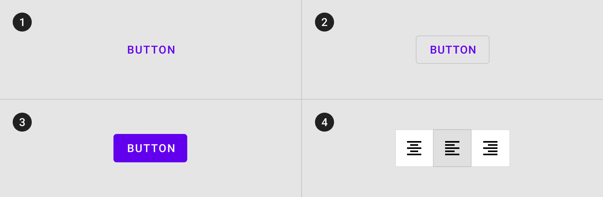
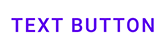

# Buttons

[Buttons](https://material.io/components/buttons/) allow users to take actions,
and make choices, with a single tap.


**Contents**
*   [Types of buttons](#types)
    *   [Text button](#text-button)
    *   [Outlined button](#outlined-button)
    *   [Contained button](#contained-button)
    *   [Toggle button](#toggle-button)
*   [Theming buttons](#theming-buttons)
*   [Making buttons accessible](#making-buttons-accessible)

## Setup

Before you can use Material buttons, you need to add a dependency to the
Material Components for Android library. For more information, go to the
[Getting started](https://github.com/material-components/material-components-android/tree/master/docs/getting-started.md)
page.

_**Note:** `<Button>` is auto-inflated as
`<com.google.android.material.button.MaterialButton>` via
`MaterialComponentsViewInflater` when using a non-Bridge
`Theme.MaterialComponents.*` theme._

## Types

There are four types of buttons: 1\. [Text button](#text-button), 2\.
[Outlined button](#outlined-button), 3\. [Contained button](#contained-button),
4\. [Toggle button](#toggle-button)



## Text button

[Text buttons](https://material.io/components/buttons/#text-button) are
typically used for less-pronounced actions, including those located in dialogs
and cards. In cards, text buttons help maintain an emphasis on card content.

### Function
```xml
TextButton(onClick: () -> Unit, modifier: Modifier = Modifier, enabled: Boolean = true,
interactionSource: MutableInteractionSource = remember { MutableInteractionSource() },
elevation: ButtonElevation? = null, shape: Shape = MaterialTheme.shapes.small,
border: BorderStroke? = null, colors: ButtonColors = ButtonDefaults.textButtonColors(),
contentPadding: PaddingValues = ButtonDefaults.TextButtonContentPadding, content: RowScope.() -> Unit)
```

Example of a text button with a label:



In the layout:

```xml
<Button
    android:id="@+id/textButton"
    android:layout_width="wrap_content"
    android:layout_height="wrap_content"
    android:text="Text button"
    style="@style/Widget.MaterialComponents.Button.TextButton"
/>
```

In code:

```kt
textButton.setOnClickListener {
    // Respond to button press
}
```

#### Adding an icon to a text button

Example of a text button with an icon and label:


In the layout:

```xml
<Button
    ...
    app:icon="@drawable/ic_add_24dp"
    style="@style/Widget.MaterialComponents.Button.TextButton.Icon"
/>
```


## Outlined button
[Outlined buttons](https://material.io/components/buttons/#text-button) are
blah blahblah description here.

### Function
```xml
TextButton(onClick: () -> Unit, modifier: Modifier = Modifier, enabled: Boolean = true,
interactionSource: MutableInteractionSource = remember { MutableInteractionSource() },
elevation: ButtonElevation? = null, shape: Shape = MaterialTheme.shapes.small,
border: BorderStroke? = null, colors: ButtonColors = ButtonDefaults.textButtonColors(),
contentPadding: PaddingValues = ButtonDefaults.TextButtonContentPadding, content: RowScope.() -> Unit)
```

Example of a text button with a label:


In the layout:

```xml
<Button
    android:id="@+id/textButton"
    android:layout_width="wrap_content"
    android:layout_height="wrap_content"
    android:text="Text button"
    style="@style/Widget.MaterialComponents.Button.TextButton"
/>
```

In code:

```kt
textButton.setOnClickListener {
    // Respond to button press
}
```

#### Adding an icon to a text button

Example of a text button with an icon and label:


In the layout:

```xml
<Button
    ...
    app:icon="@drawable/ic_add_24dp"
    style="@style/Widget.MaterialComponents.Button.TextButton.Icon"
/>
```


#### Implementing button theming

Using theme attributes and styles in `res/values/styles.xml` (themes all buttons
and affects other components):

```xml
<style name="Theme.App" parent="Theme.MaterialComponents.*">
    ...
    <item name="colorPrimary">@color/shrine_pink_100</item>
    <item name="colorOnPrimary">@color/shrine_pink_900</item>
    <item name="textAppearanceButton">@style/TextAppearance.App.Button</item>
    <item name="shapeAppearanceSmallComponent">@style/ShapeAppearance.App.SmallComponent</item>
</style>

<style name="TextAppearance.App.Button" parent="TextAppearance.MaterialComponents.Button">
    <item name="fontFamily">@font/rubik</item>
    <item name="android:fontFamily">@font/rubik</item>
</style>

<style name="ShapeAppearance.App.SmallComponent" parent="ShapeAppearance.MaterialComponents.SmallComponent">
    <item name="cornerFamily">cut</item>
    <item name="cornerSize">4dp</item>
</style>
```

or using default style theme attributes, styles and theme overlays (themes all
buttons but does not affect other components):

```xml
<style name="Theme.App" parent="Theme.MaterialComponents.*">
    ...
    <item name="borderlessButtonStyle">@style/Widget.App.Button.TextButton</item>
    <item name="materialButtonOutlinedStyle">@style/Widget.App.Button.OutlinedButton</item>
    <item name="materialButtonStyle">@style/Widget.App.Button</item>
</style>

<style name="Widget.App.Button.TextButton" parent="Widget.MaterialComponents.Button.TextButton">
    <item name="materialThemeOverlay">@style/ThemeOverlay.App.Button.TextButton</item>
    <item name="android:textAppearance">@style/TextAppearance.App.Button</item>
    <item name="shapeAppearance">@style/ShapeAppearance.App.SmallComponent</item>
</style>

<style name="Widget.App.Button.OutlinedButton" parent="Widget.MaterialComponents.Button.OutlinedButton">
    <item name="materialThemeOverlay">@style/ThemeOverlay.App.Button.TextButton</item>
    <item name="android:textAppearance">@style/TextAppearance.App.Button</item>
    <item name="shapeAppearance">@style/ShapeAppearance.App.SmallComponent</item>
</style>

<style name="Widget.App.Button" parent="Widget.MaterialComponents.Button">
    <item name="materialThemeOverlay">@style/ThemeOverlay.App.Button</item>
    <item name="android:textAppearance">@style/TextAppearance.App.Button</item>
    <item name="shapeAppearance">@style/ShapeAppearance.App.SmallComponent</item>
</style>

<style name="ThemeOverlay.App.Button.TextButton" parent="">
    <item name="colorPrimary">@color/shrine_pink_900</item>
</style>

<style name="ThemeOverlay.App.Button" parent="">
    <item name="colorPrimary">@color/shrine_pink_100</item>
    <item name="colorOnPrimary">@color/shrine_pink_900</item>
</style>
```

or using one of the styles in the layout (affects only this button):

```xml
<Button
    ...
    style="@style/Widget.App.Button"
/>
```
## Making buttons accessible

Buttons support content labeling for accessibility and are readable by most
screen readers, such as TalkBack. Text rendered in buttons is automatically
provided to accessibility services. Additional content labels are usually
unnecessary.

For more information on content labels, go to the
[Android accessibility help guide](https://support.google.com/accessibility/android/answer/7158690).
